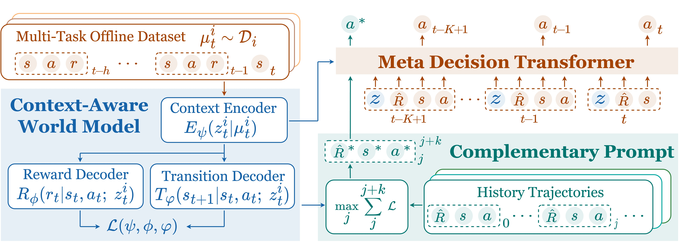

# **Meta-DT: Offline Meta-RL as Conditional Sequence Modeling with World Model Disentanglement**
Zhi Wang, Li Zhang, Wenhao Wu, Yuanheng Zhu, Dongbin Zhao, Chunlin Chen*

A link to our paper can be found on [arXiv]()

## **Overview**
Official codebase for Meta-DT: Offline Meta-RL as Conditional Sequence Modeling with World Model Disentanglement



## **Installation**
Experiments require MuJoCo and D4RL. Follow the instructions in the [[MuJoCo]](https://github.com/openai/mujoco-py)[[D4RL]](https://github.com/Farama-Foundation/D4RL) to install.
Create a virtual environment using conda, and see `requirments.txt` file for more information about how to install the dependencies.
```shell
conda create -n meta_dt python=3.8.18 -y
conda activate meta_dt
pip install -r requirements.txt
```

## **Data Collection**
Note that we set ```done = False``` in all environments, so we need to set ```done = False``` for environments ```walker``` and ```hopper``` manually in package ```rand_param_envs```.
We also share our datasets below.

### Train SAC
We use SAC to train agents on different environments and collect datasets.  
Train agents on different tasks in AntDir:
```shell
python train_data_collection.py --env_type ant_dir --save_freq 4000 --task_id_start 0 --task_id_end 5
```
in which ```task_id_start``` and ```task_id_end``` mean that training tasks of [task_id_start, task_id_end).

### Generate Datasets
We use checkpoints of traning process to generate datasets.
For ```medium``` and ```expert``` datasets, use:
```shell
python get_datassets.py --env_type ant_dir --data_type medium --task_id_start 0 --task_id_end 5 --capacity 20000
```
After obtaining datasets of all tasks, we should manually merge all ```task_info_{task_id}.json``` files into one file named ```task_info.json```.

For ```medium-expert``` datasets, we use a mix of 70% ```medium``` and 30% ```expert``` datasets.

## **Downloads Datasets and pretrained world model**
 - We share our datasets via this [datasets](https://drive.google.com/file/d/1msndM9eVQ9KI6TGRNBgAaOm6I0jSoW8V/view?usp=drive_link)
 - We share our pretrained world model via this [world_model](https://drive.google.com/file/d/1su9Uv_l3PmKWprAMMd2fBVe0rBC3F9f-/view?usp=drive_link)
## **Run Experiments**
Train the context encoder using world model 
```shell
python train_context.py --env_name AntDir-v0
```

Train the Meta Decision Transformer for few_shot Meta-DT
```shell
python train_meta_dt.py --env_name AntDir-v0 --zero_shot False --data_quality medium 
```
Train the Meta Decision Transformer for zero_shot Meta-DT
```shell
python train_meta_dt.py --env_name AntDir-v0 --zero_shot True --data_quality medium
```

## **Citation**

Please cite our paper as:
```tex
@inproceedings{
wang2024metadt,
title={Meta-DT: Offline Meta-RL as Conditional Sequence Modeling with World Model Disentanglement},
author={Zhi Wang and Li Zhang and Wenhao Wu and Yuanheng Zhu and Dongbin Zhao and Chunlin Chen},
booktitle={Advances in Neural Information Processing Systems},
year={2024},
}
```
